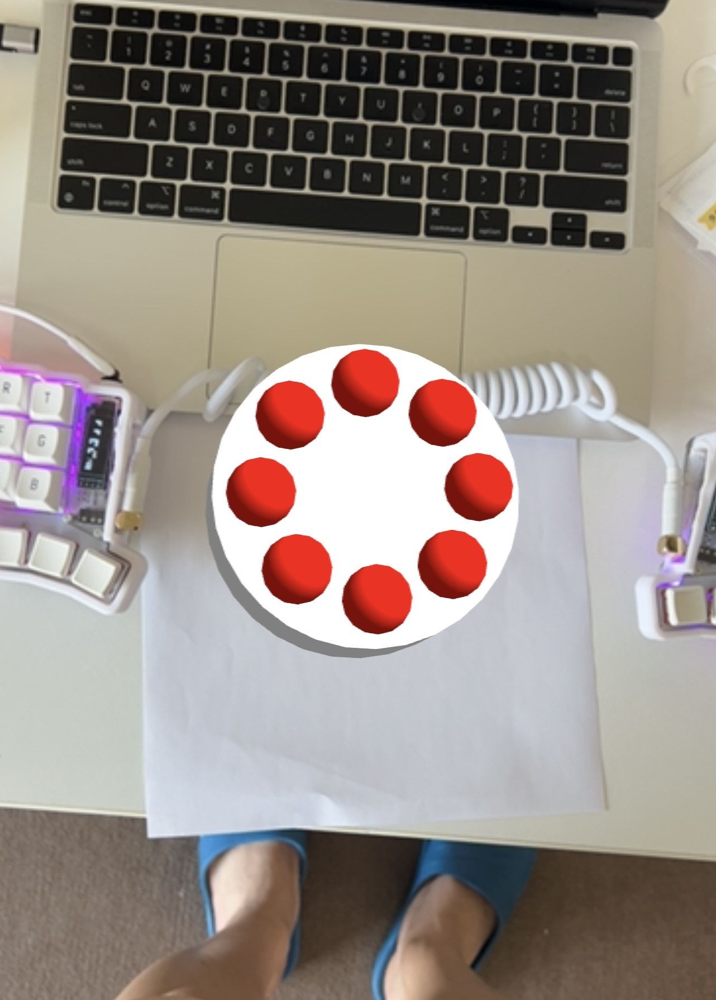
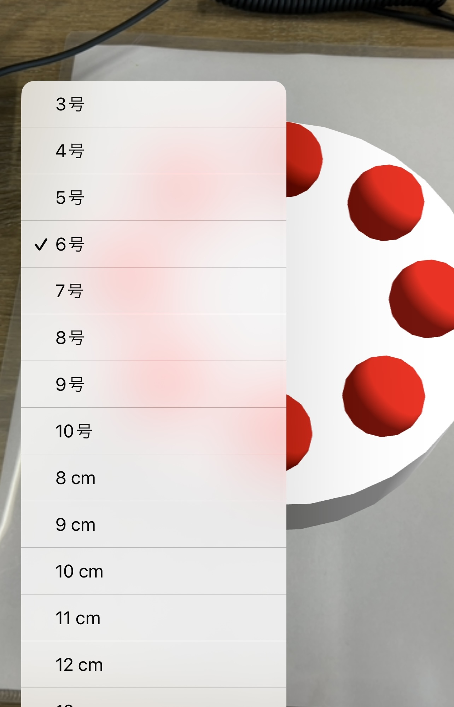

# AR Cake

AR Cakeは、AR.jsとThree.jsを使用して、ケーキを仮想的に表示し、サイズを変更することでケーキのサイズをシミュレーション出来ます。

## 使用法

[A4_hiro_marker.pdf](A4_hiro_marker.pdf)をA4で印刷して、[https://ar-cake.vercel.app/](https://ar-cake.vercel.app/)にアクセスして、印刷したマーカーにかざすと、ケーキを投影できます。画面下のプルダウンメニューからケーキのサイズを変更可能です。

## 使用イメージ

